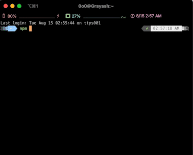

# AUSG

> AUSG CLI Library

## Install

```bash
$ npm install --global ausg
```

## CLI

```
$ ausg --help

	Usage
	  $ ausg

	Options
  	--name
    --member AUSG 기수

	Examples
	  $ ausg --name=김태강
	  AUSG CLI에 오신 것을 환영합니다, 김태강님!
```


